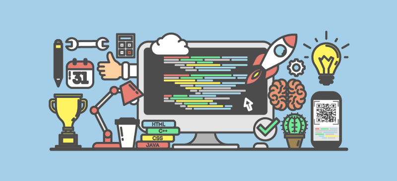

# Programación

Aquí puedes encontrar los apuntes del módulo de _Programación_, que se imparte en el primer curso del ciclo formativo de grado superior de Desarrollo de Aplicaciones Multiplataforma.

La duración del módulo es de 256 horas lectivas, a razón de  **8 horas semanales**. Se ha planificado basándose en 4 sesiones de 2 horas lectivas por semana.

## Resultados de aprendizaje

1. Reconoce la estructura de un programa informático, identificando y relacionando los elementos propios del lenguaje de programación utilizado.
2. Escribe y prueba programas sencillos, reconociendo y aplicando los fundamentos de la programación orientada a objetos.
3. Escribe y depura código, analizando y utilizando las estructuras de control del lenguaje.
4. Desarrolla programas organizados en clases analizando y aplicando los principios de la programación orientada a objetos.
5. Realiza operaciones de entrada y salida de información, utilizando procedimientos específicos del lenguaje y librerías de clases.
6. Escribe programas que manipulen información seleccionando y utilizando tipos avanzados de datos.
7. Desarrolla programas aplicando características avanzadas de los lenguajes orientados a objetos y del entorno de programación.
8. Utiliza bases de datos orientadas a objetos, analizando sus características y aplicando técnicas para mantener la persistencia de la información.
9. Gestiona información almacenada en bases de datos relacionales manteniendo la integridad y consistencia de los datos.

## Unidades didácticas / Temporalización

A continuación se muestran las unidades didácticas y una estimación temporal de cada una de ellas. El curso está dividido en 10 unidades didácticas distribuidas en tres trimestres.

### Primera evaluación

1. Elementos de un programa informático (10 sesiones, 20 horas)
2. Estructuras básicas de control (13 sesiones, 26 horas)
3. Arrays (9 sesiones, 18 horas)
4. Programación orientada a objetos. Clases y Objetos (12 sesiones, 24 horas)
5. Herencia y polimorfismo (14 sesiones, 28 horas)

### Segunda evaluación

6. Colecciones (15 sesiones, 30 horas)
7. Programación avanzada (10 sesiones, 20 horas)
8. Interfaces de usuario (16 sesiones, 32 horas)

### Tercera evaluación

9. Persistencia de la información (13 sesiones, 26 horas)
10. Bases de datos (16 sesiones, 32 horas)

## Instrumentos de calificación

La nota de cada evaluación se calcula mediante:

-   30% Trabajo en Clase / Actividades
-   Se evalúan todas las actividades realizadas en clase y en casa.
-   Las actividades se evalúan mediante tareas de Aules con calificaciones comprendidas entre 0 y 3 puntos:
    -   0: No entregada
    -   1: Entregada pero solución errónea o incompleta
    -   2: Entregada y solución aceptable, aunque tiene algún apartado incompleto
    -   3: Entregada y solución correcta.
-   70% Actividad de evaluación
-   Una o dos pruebas por evaluación.

La nota final se calcula mediante la media de cada una de las evaluaciones.
