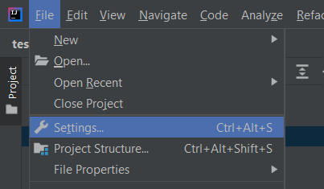
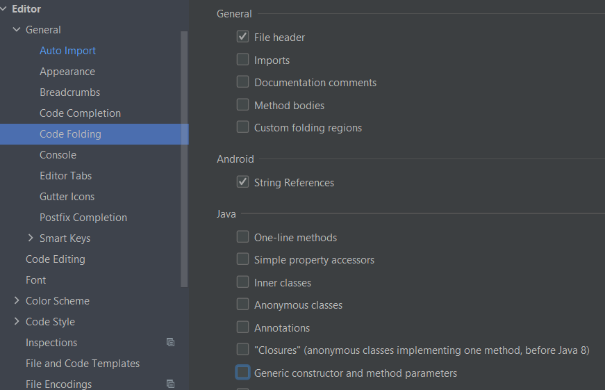

# 💾 ¿Qué se necesita para programar en Java?

+ Instalar el JDK la úlltima release, versión estable de Java. Lo podemos descarga desde la página oficial de Oracle.
+ Instalar un IDE (Integrated Development Environment), es un programa que te ayudar a desarrollar aplicaciones. Hay muchas opciones disponibles de IDEs.


## Setup JDK Java y IntelliJ en Windows

1. Vamos a la página de Oracle y descargamos el JDK.

2. Instalamos el JDK.

>En linux usamos el siguiente comando para instalar el jdk: sudo apt-get install openjdk-XX-jdk, donde XX es la versión del java.

3. Windows: Añadimos en las variables de entorno del sistema dentro de la variable Path, la ruta donde se ha instalado java en nuestra máquina (C:\Program Files\Java\jdk-*VERSION*\bin)

4. Windows: Agregamos también una nueva variable llamada JAVA_HOME --> C:\Program Files\Java\jdk-*VERSION* (Ruta de nuestra máquina).

5. Verificamos que se ha instalado java, ejecutando desde línea de comandos:

```bash
java --version
```

6. Descargamos e instalamos [IntelliJ Community](https://www.jetbrains.com/idea/download/#section=windows)

7. En File -> Settings, modificamos las siguientes opciones:



