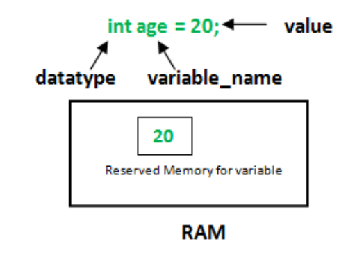
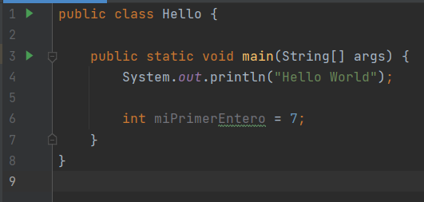

# 💾 Variables

<p style='text-align: justify;'>Las variables en Java es una forma de almacenar información en nuestro ordenador. Definimos variables asignándoles un nombre. De igual manera se puede acceder a la información que guardar las variable, simplemente accediendo por el nombre que le hemos dado.
Es el ordenador el que se encarga de averiguar dónde se almacena internamente en la memoria RAM del ordenador.
Como su nombre indica "variable", se puede modificar el contenido que ésta almacena, es decir, es variable. Lo único que tenemos que hacer es decirle al PC qué tipo de información queremos guardar en nuestra variable y darle un nombre.
Existe diferentes tipos de información que podemos utilizar para definir nuestras variables. Se les conoce como <strong>tipos de datos</strong> o data types.
Los tipos de datos son palabras reservas <strong>keywords</strong> en Java, es decir, no podemos utilizarlas fuera del contexto de tipo de datos.

Para definir una variable, necesitamos especificar el tipo de datos, luego darle un nombre a nuestra variable, y opcionalmente, podemos agregar una expresión para inicializar la variable con un valor.
</p>

## Reglas para el nombrado de variables

+ Tiene que comenzar con una letra o '_', nunca con números.

+ Puede contener números. No debe contener espacios en blanco.

+ No debe ser muy largo y debe expresar algo en el contexto.

+ No se pueden usar palabras reservadas.

+ Mayúsculas y minúsculas se tratan diferente.



Definimos nuestra primera variable en el programa de la siguiente forma:


La línea que acabamos de escribir se conoce como **sentencia de declaración**.

## Keywords

Son palabras reservadas del lenguaje. Es decir, son palabras que tienen un significado especial en Java y no puedes usarlas fuera de ese contexto.
Ejemplos: public, class, void, static, etc.
Existen 61 [keywords](https://en.wikipedia.org/wiki/List_of_Java_keywords) en Java.

## Vida de las variables

Las variables son memorias reservadas para almacenar valores en RAM. Estas posiciones de memoria se liberan tan pronto como termina la vida de la variable. Según la vida de las variables, hay tres tipos de Variables.

**1. Variables locales**: La vida permanece dentro de un bloque donde se ha declarado.

**2. Variables de instancia**: Declaradas dentro de la clase pero fuera de los métodos. No debería ser estático.

**3. Variables estáticas**: es como una variable global. Declarado como estático en la clase pero fuera de los métodos.

```java
    static int pi = 3.14;
```

## Visibilidad

En las variables locales, su ámbito y uso se encuentra dentro del método o bloque en el que se definió y se destruyen después de la ejecución del método. Es decir, no se puede usar una variable local fuera del método actual.

A las variables de instancia se puede acceder solo a través de objetos de la clase para la que se definió.

Un campo / variable estático pertenece a la clase y se cargará en la memoria junto con la clase. Se invocan sin crear un objeto. (Usando el nombre de la clase como referencia). Solo hay una copia de la variable estática disponible en toda la clase, es decir, el valor de la variable estática será el mismo en todos los objetos. Puede definir una variable estática utilizando la palabra clave **static**.

## Mutación de las variables

Supongamos que hemos ejecutado la siguiente línea de código:

```java
int x = 5;
```

¿Cómo podríamos sumar 6 al valor actualmente almacenado en `x`? Un enfoque ingenuo podría ser probar esta línea de código:

```java
    x + 6;
```

Sin embargo, esta línea de código es una expresión que da como resultado un valor: **no hemos alterado el valor de x**.

```java
// Recuerda, x es una variable que contiene el valor 5
x + 6; // se evalúa como:
5 + 6; // y luego da como resultado:
11;

// Pero 11; no es una declaración que Java entienda,
// entonces el compilador lanza un error cuando ve: x + 6;
```

Para aumentar el valor de `x` en 6, necesitamos reasignar el valor de `x` para que sea el resultado de `x + 6`:

```java
x = x + 6; // se evalúa como:
x = 5 + 6; // y luego se suman los valores
x = 11;// como resultado se asigna el valor 11 a x
```

Aquí, hemos usado el valor de `x` para calcular y almacenar un nuevo valor en la variable `x`; en este caso, 11.

## Scope - Ámbito

El alcance o ámbito (**scope**) de una variable es la parte de un programa *en la que existe.* En Java, el alcance de una variable comienza donde se declara y termina cuando se alcanza la llave de cierre del bloque que la contiene.

```java
public static void main(String[] args) {
     int x = 5;
     for (int i = 1; i <= 5; i++) {
        int y = 10;
        System.out.println(x) // ¡x todavía está dentro del alcance aquí!
     }
     System.out.println(x) // ¡x todavía está dentro del alcance aquí también!
}
```

+ `x` está dentro del alcance entre su declaración en la línea 2 y la llave que la encierra en la línea 8.
+ `y` está dentro del alcance entre su declaración en la línea 4 y la llave que la encierra en la línea 6.
+ Las variables de bucle están dentro del alcance entre sus bucles `for` { }. Entonces, `i` está dentro del alcance entre las líneas 3 - 6.
Nota: Dos variables con el mismo nombre no pueden existir dentro del mismo ámbito (scope).
