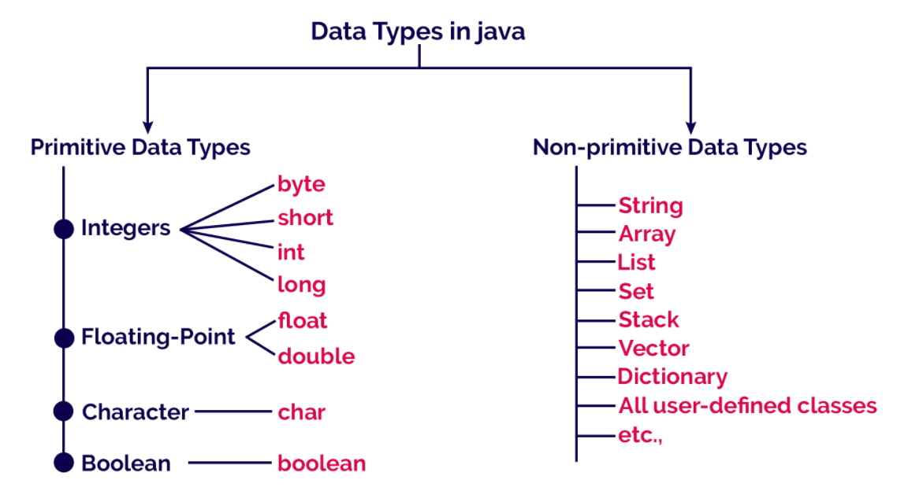

# 💾 Tipos de datos

Un tipo de datos es un conjunto de valores y un conjunto de operaciones definidas en ellos.
Se pueden clasificar en primitivos y objetos.


## Primitivos

Los primitivos son los más básicos y fundamentales, vienen integrados en Java. Especifican el tipo de valor almacenado en una variable y el tamaño de la memoria. Hay 8 tipos primitivos de datos integrados en el lenguaje Java. Estos incluyen: int, byte, short, long, float, double, boolean y char.

| Primitive data type | Wrapper class |
|---------------------|---------------|
| byte                | Byte          |
| short               | Short         |
| int                 | Integer       |
| long                | Long          |
| float               | Float         |
| double              | Double        |
| boolean             | Boolean       |
| char                | Character     |

### byte

Como su propio nombre denota, emplea un solo byte (8 bits) de almacenamiento. Esto permite almacenar valores en el rango [-128, 127]. Raramente se usa. Ocupa menos memoria y puede ser más rápido accedido.

```java
  byte b = 2;
```

### short

Usa el doble de almacenamiento que el anterior, es decir, ocupa 16 bits [-32.768, 32.767].

```java
  short s = 3467;
```

### int

Emplea 4 bytes (32 bits) de almacenamiento y es el tipo de dato entero más empleado. Necesita cuatro veces el espacio que ocupa un byte. **Es el entero predeterminado usado en Java.**

```java
        int maxValor = 2147483647;
        // after java 7 and higher
        int maxValue = 2_147_483_647;
```

### long

Es el tipo entero de mayor tamaño, 8 bytes (64 bits). Para definir un long, tenemos que hacerlo de la siguiente forma:

```java
  long myLongNumber = 500L;
```

### float

Tiene una parte flotante que sirve para expresar números decimales. Es de simple precisión (formato y cantidad de espacio que ocupa) porque ocupa 32 bits. No se recomienda mucho su uso.

```java
  float f = 4;
  float f = 4f; //también válida
```

### double

Es un número de precisión doble y ocupa 64 bits. **Es el flotante predeterminado en Java.** Se recomienda su uso. Muchas librerías internas de Java, relacionadas con operaciones matemáticas, usan double.

```java
  double d = 5;
  double d = 5d; //también válida
```

### char

Se utiliza para almacenar caracteres (letras, números, signos, etc.) individuales. Ocupa 2 bytes en memoria (16 bits). Permite almacenar caracteres Unicode. Unicode es un estándar de codificación internacional que nos permite representar diferentes idiomas; y la forma en que funciona es usando una combinación de los dos bytes que un char ocupa en la memoria, que puede representar hasta 65535 diferentes tipos de caracteres. [Unicode table.](https://unicode-table.com/en/)

```java
  char c = 'P';
  char u = '\u00A2';//print unicode character
```

Un carácter precedido por una barra invertida (\) es una secuencia de escape y tiene un significado especial para el compilador. La siguiente tabla muestra las secuencias de escape de Java:


### boolean

solo permite almacenar dos posibles valores que son _true_ o _false_. Tiene la finalidad de facilitar el trabajo con valores "verdadero/falso" (booleanos), resultantes por regla general de evaluar expresiones.

Este tipo de datos representa un bit de información, pero su "tamaño" no es algo que esté definido con precisión.

```java
  boolean isMyNamePatri = true;
```

***

## Wrapper classes (clases contenedores)

Las clases contenedoras proporcionan una forma de utilizar tipos de datos primitivos como objetos. En Java, tenemos una Wrapper class para cada uno de los 8 tipos de datos primitivos. Gracias a esto, podemos realizar operaciones en un dato primitivo como por ejemplo en un int:

```java
   int minimoValorInt = Integer.MIN_VALUE;
```

***
