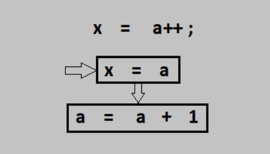
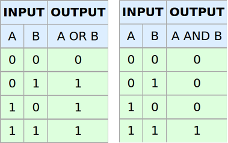
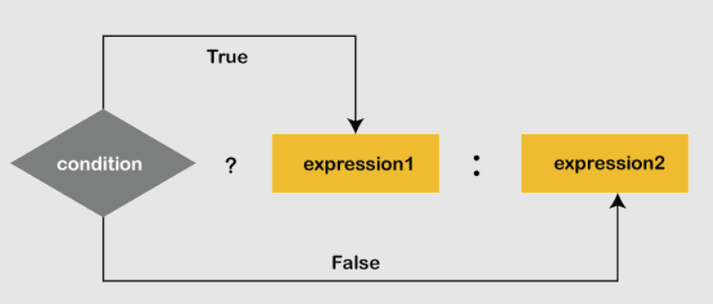

# 💾 Operadores

Los operadores son símbolos especiales en Java que realizan operaciones entre uno o varios operandos y devuelve un resultado. Uno de los más usados es el operador suma (+) como hemos visto en clases anteriores.

## Operando

Es cualquier término, que puede ser una variable o valor y que es manipulado por un operador.

```java
   int valor = 8;
   int numero = valor + 12;
```

En el ejemplo anterior, _+_ es el operador y _valor_ y _12_ son los operandos. _valor + 12_ es una expresión que devuelve el resultado de 20.

## Expresiones

Una expresión es una combinación de literales, operadores, nombres de variables y paréntesis que se utilizan para calcular un valor.

```java
  int miPrimerEntero = 7 + 5;
  int resultado = 0;

  resultado = (miPrimerEntero * 10) / (32 + 12);
```

Java examina la expresión de la derecha del signo igual y realiza el cálculo de una expresión matemática. Después asigna ese valor a la variable resultado.
Podríamos complicar más la expresión utilizando **operadores** como paréntesis, multiplicaciones, divisiones, etc.

Las partes de una expresión deben estar ordenadas correctamente. Las reglas para las expresiones Java correctas son casi las mismas que las del álgebra:

1. Cada operador debe tener el número correcto de operandos.

      + Multiplicación *, División /, Suma +, Resta: debe tener dos operandos, uno en cada lado.
      + La negación - y unario más + deben ir seguidos de un operando.

2. Los paréntesis () pueden rodear una expresión legal para convertirla en operando.


### Expresiones mixtas con int y double

{==

Si ambos operandos de un operador aritmético son de tipo int, entonces la operación es una operación entera. Si algún operando es de punto flotante, entonces la operación es de punto flotante.

==}

## Tipos de operadores en Java

Java proporciona muchos tipos de operadores que se pueden usar según la necesidad. Se clasifican según la funcionalidad que brindan. Algunos de los tipos son los siguientes:

Operadores aritméticos, unarios, de asignación, relacionales, lógicos, etc.

## Operador de asignación (=)

Es uno de los operadores más usados. Se usa para asignar un valor a cualquier variable. Tiene una asociación de derecha a izquierda, es decir, el valor dado en el lado derecho del operador se asigna a la variable de la izquierda y, por lo tanto, el valor del lado derecho debe declararse antes de usarlo o debe ser una constante.

## Operadores aritméticos

Se utilizan para realizar operaciones aritméticas simples.

| Símbolo | Operación | Descripción                        |
|---------|-----------|------------------------------------|
| +       | Suma      | Realiza la suma de los operandos.  |
| -       | Resta     | Realiza la resta de los operandos. |
| *       | Producto  | Multiplica los operandos.          |
| /       | División  | Realiza la división.               |
| %       | Módulo    | Calcula el resto.                  |

## Operadores unarios

Los operadores unarios solo necesitan un operando. Se usan para incrementar, disminuir o negar un valor.

| Símbolo | Operación  | Descripción                      |
|---------|------------|----------------------------------|
| ++      | Incremento | Incrementa el valor en 1 unidad. |
| --      | Decremento | El valor disminuye en 1 unidad.  |
| !       | NOT lógico | Invierte un valor booleano.      |

Existen dos versiones de estos operadores:

+ Pre-incremento y pre-decremento. El valor se aumenta/disminuye primero y luego se calcula el resultado.


  ```java
   int a = 8, b = 1;
   b = ++a; //b=9, a=9
  ```
  
+ Post-Incremento y post-decremento: el valor se usa por primera vez para calcular el resultado y luego se incrementa/decrementa.

  ```java
   int a = 8, b = 1;
   b = a++;//b = 8, a = 9
  ```



## Operadores relacionales

Estos operadores se utilizan para verificar relaciones como igualdad, mayor que, menor que. Devuelven el resultado booleano después de la comparación.

| Símbolo | Operación         | Descripción                                                                           |
|---------|-------------------|---------------------------------------------------------------------------------------|
| ==      | Igual a           | Devuelve verdadero si el valor de la izquierda del símbolo es igual al de la derecha. |
| !=      | Distinto a        | Devuelve verdadero si el valor de la izquierda es distinto al de la derecha.          |
| <       | Menor que         | Devuelve verdadero si el valor de la izquierda es menor que el de la derecha.         |
| <=      | Menor o igual que | Devuelve verdadero si el valor de la izquierda es menor o igual que el de la derecha. |
| \>      | Mayor que         | Devuelve verdadero si el valor de la izquierda es mayor que el de la derecha.         |
| \>=     | Mayor o igual que | Devuelve verdadero si el valor de la izquierda es mayor o igual al de la derecha.     |                                                                                 |

```java
  int a = 20, b = 10;
  System.out.println("a == b :" + (a == b));//Devuelve falso, porque a no es igual a b
```

## Operadores lógicos

Estos operadores se utilizan para realizar operaciones lógicas **AND** y **OR**. Se usa ampliamente en sentencias if-then o bucles para verificar condiciones, establecer un punto de salida de un bucle o la toma de  decisiones.
Los operadores condicionales son:

| Símbolo | Operación  | Descripción                                              |
|---------|------------|----------------------------------------------------------|
| &&      | AND lógico | Devuelve verdadero cuando ambas condiciones son ciertas. |
| \|\|    | OR lógico  | Devuelve verdadero si al menos una condición es cierta.  |



```java
    int a = 20, b = 10, c= 10;
    System.out.println((b == c && a == c)); //False
    System.out.println((a == c && b == c)); //False
    System.out.println((a == b || b == c)); //True
```

## Operadores de bits

| Símbolo | Operación | Descripción                                                                                                      |
|---------|-----------|------------------------------------------------------------------------------------------------------------------|
| &       | AND       | Si ambos bits de entrada son 1, establece como resultado 1. De lo contrario 0.                                   |
| \|      | OR        | Si por lo menos uno de los bits de entrada es 1, establece como resultado 1. De lo contrario 0.                  |
| ^       | XOR       | Si uno de los bits de entrada es 1 y el otro 0, establece como resultado 1. Si los bits son iguales establece 0. |
| ~       | NOT       | Invierte todos los bits y devuelve el resultado en complemento a 2.                                              |

## Operador ternario (?:)

Ternario es una versión abreviada de la sentencia if-else. Tiene tres operandos y de ahí el nombre ternario. El formato general es:



La declaración anterior significa que si la condición se evalúa como verdadera, entonces ejecuta las instrucciones después del ‘?‘ de lo contrario, ejecuta las instrucciones después de ‘:‘.

```java
  int nota = 7;
  String notaFinal = (nota >= 5) ? "Aprobado" : "Suspendido";
  System.out.println(notaFinal); //muestra Aprobado
```

## Abreviaciones

En muchos casos, el operador de asignación se puede combinar con otros operadores para construir una versión más corta de la declaración llamada Declaración Compuesta (Compound Statement).

+ += , para sumar el operando izquierdo con el operando derecho y luego asignarlo a la variable de la izquierda.
  
  ```java
    int a = 5;
    a += 5; // a = a + 5;
  ```

+ – = , para restar el operando izquierdo con el operando derecho y luego asignarlo a la variable de la izquierda.

  ```java
    int a = 5;
    a -= 5; // a = a - 5;
  ```

+ *= , para multiplicar el operando izquierdo con el operando derecho y luego asignándolo a la variable de la izquierda.

  ```java
    int a = 5;
    a *= 5; // a = a * 5;
  ```

+ / = , para dividir el operando izquierdo con el operando derecho y luego asignarlo a la variable de la izquierda.

  ```java
    int a = 5;
    a /= 5; // a = a / 5;
  ```

+ % = , para asignar el módulo del operando izquierdo con el operando derecho y luego asignarlo a la variable de la izquierda.

  ```java
    int a = 5;
    a %= 5; // a = a % 5;
  ```

## Precedencia de operadores

El orden de precedencia, es decir, como Java decide la prioridad al evaluar los operadores en una expresión, se puede ver en [Java Operator Precedence Table](http://www.cs.bilkent.edu.tr/~guvenir/courses/CS101/op_precedence.html)

## Conversiones de tipo

### Conversiones por defecto

Las reglas de Java para saber el tipo de datos resultante de una expresión se siguen las siguientes reglas:

| Si algún operando es | El otro operando se transforma a |
|----------------------|----------------------------------|
| double               | double                           |
| float                | float                            |
| long                 | long                             |
| byte or short        | int                              |

Si se aplican dos regla, se elige la que aparece primero en la tabla.

### Conversiones forzosas (casting entre tipos nativos)

Es una forma de convertir un número de un tipo a otro tipo de dato. Para hacerlo ponemos en paréntesis el tipo de dato al que queremos convertirlo.

```java
    byte miByte = (byte) (14 / 2); //conviero la operación división que devuelve un int a byte

    //Otra forma
    float a = 8.0f;
    int b = 10;
    b = (int) a;//convierto el tipo float a int
```

!!! Note "Otros operadores"
    Existen más operadores que no se han mencionado en el curso. Si se desea consultar todos los operadores de Java se pueden ver en su documentación oficial. [More information](https://docs.oracle.com/javase/tutorial/java/nutsandbolts/opsummary.html)

## Sintaxis de las expresiones matemáticas

| Método    | Returns         | Ejemplo                          |
|-----------|-----------------|----------------------------------|
| Math.abs  | valor absoluto  | Math.abs(-308) returns 308       |
| Math.ceil  | redondeo hacia arriba  | Math.ceil(2.13) returns 3.0       |
| Math.floor  | redondeo hacia abajo  | Math.floor(2.93) returns 2.0       |
| Math.max  | valor máx. de dos valores  | Math.max(45, 207) returns 207       |
| Math.min  | valor min. de dos valores  | Math.min(3.8, 2.75) returns 2.75       |
| Math.pow  | potencia  | Math.pow(3, 4) returns 81.0       |
| Math.round  | redondear al entero más cercano  | Math.round(2.718) returns 3       |
| Math.sqrt  | raíz cuadrada  | Math.sqrt(81) returns 9.0       |
