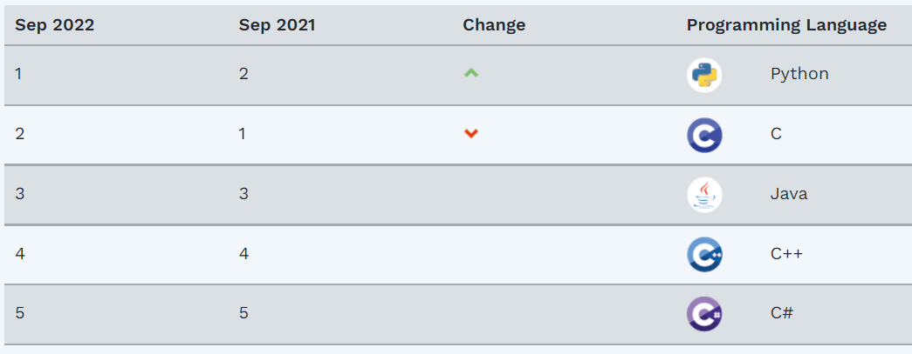

# 💾 Elementos de un programa informático

<p style='text-align: justify;'>
Un programa es una secuencia de instrucciones que un ordenador ejecuta para realizar alguna tarea.
Parece una idea bastante simple, pero para que el ordenador pueda hacer uso de las instrucciones, deben estar escritas de forma que las pueda usar. Esto significa que los programas deben estar escritos en lenguajes de programación. Los lenguajes de programación se diferencian de los lenguajes humanos ordinarios en que son completamente inequívocos y muy estrictos sobre lo que está y no está permitido en un programa. Las reglas que determinan lo que está permitido se denominan sintaxis del lenguaje. Las reglas de sintaxis especifican el vocabulario básico del lenguaje y cómo se pueden construir los programas.
</p>
***
## Lenguajes de programación
Se trata de un conjunto de instrucciones que permite la comunicación de los humanos con los ordenadores.




1. C --> bases de datos, videojuegos, kernel linux, IOT, dispositivos inteligentes, etc.
2. Python --> inteligencia artificial, big data, etc.
3. Java --> puntos de ventas, aplicaciones de escritorio, cajeros automáticos, dispositivos móviles, ...


## ¿Con qué lenguaje de programación debo empezar?

> En realidad, no existe el mejor lenguaje de programación para empezar, y el lenguaje que elijas prácticamente no tendrá un efecto duradero en tu carrera.
Los lenguajes de programación pueden verse muy diferentes en la superficie, pero la mayoría de los conceptos fundamentales se transferirán de un lenguaje a otro.
Aprender un nuevo idioma también será más fácil con el tiempo; un principiante puede tardar meses antes de que se sienta cómodo con su primer lenguaje;
un programador experimentado puede familiarizarse con un nuevo idioma en cuestión de días.
***

## 7 Tips para aprender a programar con éxito

```bash
1. Learn by doing. Always play with the code while learning
2. Grasp the fundamentals for long-term benefits
3. Code by hand. It sharpens proficiency and you’ll need it to get a job
4. Ask for help. You’ll need it
5. Seek out more online resources. There’s a wealth of content
6. Don’t just read the sample code. Tinker with it!
7. Take breaks when debugging
```

Fuente: [Coding dojo](https://www.codingdojo.com/blog/7-tips-learn-programming-faster)

!!! tip
    Sé persistente, no te rindas!
***
