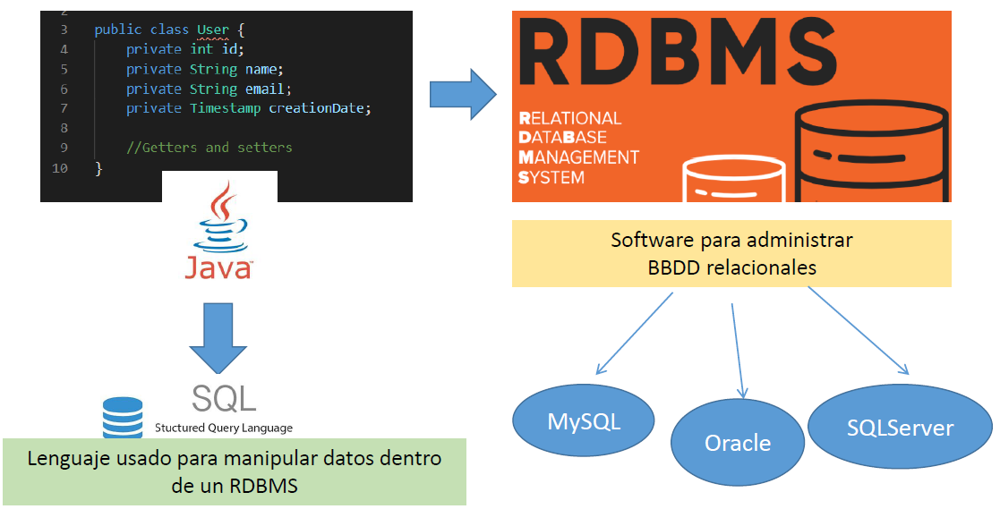

# Persistencia de la información

La persistencia es la capacidad de guardar el estado de un objeto en algún tipo de almacenamiento, para poder restaurarlo en algún momento posteriormente.

Hoy en día, la mayoría de aplicaciones informáticas necesitan almacenar y gestionar gran cantidad de datos.

Esos datos, se suelen guardar en bases de datos relacionales, ya que éstas son las más extendidas actualmente.

## Tipos de bases de datos

Una base de datos es una herramienta que recopila datos, los organiza y los relaciona para que se pueda hacer una rápida búsqueda y recuperar con ayuda de un ordenador. Hoy en día, las bases de datos también sirven para desarrollar análisis. Las bases de datos más modernas tienen motores específicos para sacar informes de datos complejos.

Además, es importante saber que hay varios tipos de base de datos: la relacional; la distribuida; NoSQL; orientada a objetos; y, gráficas. La existencia de estas diversas bases de datos se debe a la variedad de forma de trabajo que se requiere de ellas.

Las bases de datos relacionales representan la información en forma de tablas, con filas y columnas que se relacionan mediante campos clave. Además se trabaja con el lenguaje estándar conocido como **SQL**, para poder realizar las consultas que deseemos a la base de datos.

El sistema gestor de bases de datos, en inglés conocido como: _Database Management System_ (DBMS), gestiona el modo en que los datos se almacenan, mantienen y recuperan.

En el caso de una base de datos relacional, el sistema gestor de base de datos se denomina: _Relational Database Management System_ (RDBMS).

Tradicionalmente, la programación de bases de datos ha sido un caos debido a la gran cantidad de productos de bases de datos en el mercado, cada uno con sus características y lenguaje diferente.