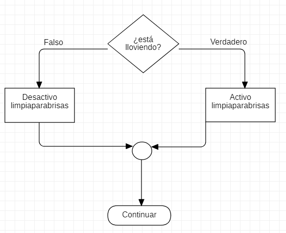
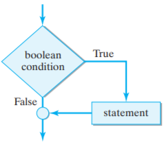
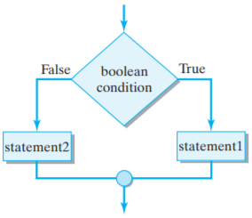
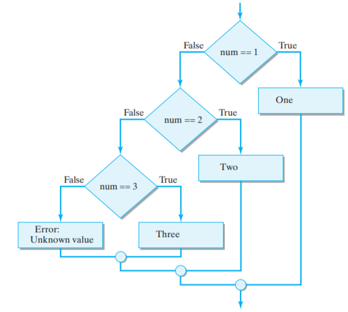

# Sentencia _IF_

Este apartado analiza cómo los programas del ordenador toman decisiones utilizando la sentencia **_if_**. Esta sentencia es uno de los bloques de construcción fundamentales de la programación.

Veamos cómo funciona.

Los limpiaparabrisas se controlan con un interruptor de encendido y apagado. El diagrama de flujo de la derecha muestra cómo se toma esta decisión.

Comience en la parte superior del gráfico y luego siga la línea hasta la pregunta:

>¿esta lloviendo?
La respuesta es verdadera o falsa.



Si la respuesta es verdadera,

+ siga la línea etiquetada como Verdadero,
+ siga las instrucciones en el cuadro "Activo limpiaparabrisas ,
+ siga la línea para "Continuar".

Si la respuesta es falsa,

+ siga la línea etiquetada como Falso,
+ siga las instrucciones en el cuadro "limpiaparabrisas desactivados",
+ siga la línea para "Continuar".

??? example "Ejemplo del programa en código"

        public static void main(String[] args) {
            Scanner scan = new Scanner( System.in );
            String respuesta;
            System.out.print("¿Está lloviendo? (Y or N): ");
            respuesta = scan.nextLine();

            if (respuesta.equals("Y")) {
                System.out.println("Activa limpiaparabrisas");
            } else {
                System.out.println("Desactiva limpiaparabrisas");
            }
        }

## Sentencia simple condicional _if_

La declaración if es la más básica de todas las declaraciones de flujo de control. Le dice a su programa que ejecute una determinada sección de código solo si una prueba en particular se evalúa como verdadera.
La sentencia simple condicional if tiene la siguiente estructura:

```java
    if (*condición*) {
        //sentencias
    }
```



**_Condicion_** es una expresión booleana. Recuerde que una expresión es una combinación de literales, operadores, nombres de variables y paréntesis que se utilizan para calcular un valor, o incluso una llamada a un método.

{==

Una [expresión booleana](./11booleanexpressions.md) es una expresión que se evalúa como verdadera o falsa.

==}

Dada esta descripción de la sintaxis de la sentencia if, los siguientes son ejemplos de sentencias if válidas:

```java

    if (true) {
        System.out.println("expresión if");
    }

    int num = 6;
    if (num > 0) {
        System.out.println("El número es positivo.");
    }
```

## Sentencia condicional compuesta _if-else_

Una segunda versión de la sentencia if incorpora una cláusula _else_ en la estructura. Esto nos permite ejecutar cualquiera de dos declaraciones separadas (simple o compuesta) como resultado de un booleano expresión.

```java
    if (*condición*) {
        //sentencias 1
    } else {
        //sentencias 2
    }
```



Ejemplo:

```java
    int numJugadores = 2;

    if (numJugadores == 1) {
        System.out.println("Single player");
    } else {
        System.out.println("Multiplayer");
    }
```

## Sentencia condicional _if-else_ múltiple

Lo que se ejecuta dentro de los if or else, es decir las sentencias pueden ser a su vez sentencias if-else. En otras palabras, es posible incrustar una o más sentencias if-else dentro de otra sentencia if-else, creando así una estructura de control anidada. Como ocurre con la mayoría de las cosas, hacer una estructura de control demasiado compleja no es una buena idea, pero existe una estructura de control estándar anidada ifelse que es muy útil. Se conoce como selección de múltiples vías.

```java
    if (*condición*) {
        //sentencias 1
    } else if (*condición*) {
        //sentencias 2
    } else if (*condición*) {
        ...
    } else {
        //sentencias
    }
```



Ejemplo:

```java
    if (numJugadores == 1) {
        System.out.println("Single player");
    } else if (numJugadores == 2) {
        System.out.println("Two player");
    } else if (numJugadores == 3) {
        System.out.println("Multiplayer");
    } else {
        System.out.println("Not possible, too many players");
    }
```
