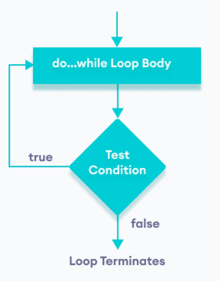

# Sentencia _DO-WHILE_

El bucle _**do-while**_ es una variante del bucle while que proporciona el lenguaje de programación Java. Se puede expresar de la siguiente forma:

```java
    //inicializadores
    do {
        //bloque de código: sentencia(s)
        //actualizador
    } while (condición);
```



La diferencia entre do-while y while es que do-while evalúa la condición después de ejecutar el cuerpo del bucle. Por lo tanto, las sentencias dentro del bloque do-while se ejecutan **al menos una vez**.

!!! warning "Una estructura while correctamente diseñada debe incluir 3 partes:"
    + un inicializador,
    + una condición de bucle y
    + un actualizador. El actualizador debe garantizar que la condición de entrada del bucle finalmente falle, **permitiendo así que el bucle termine**.

## Ejemplo: _Muestra los números del 0 al 4_

```java
    int i = 0;

    do {
        System.out.println(i);
        i++;
    } while (i < 5);
```

Salida

```code
    0
    1
    2
    3
    4
```

Traza

| Iteración | Variable | i < 5          | Acción                   |
|-----------|----------|----------------|--------------------------|
|           | i = 0    | no se verifica | imprime 0, incrementa i=1 |
| 1a        | i = 1    | true           | imprime 1, i = 2          |
| 2a        | i = 2    | true           | imprime 2, i = 3          |
| 3a        | i = 3    | true           | imprime 3, i = 4          |
| 4a        | i = 4    | true           | imprime 4, i = 5          |
| 5a        | i = 5    | false          | termina                  |

## Ejemplo: _Sumar los números del 0 al 10_

```java
    int i = 0; //inicializador
    int suma = 0;

    do {
        suma = suma + i;
        i++;//actualizador
    } while (i <= 10);

    System.out.println(suma);
```

Salida

```code
    55
```
