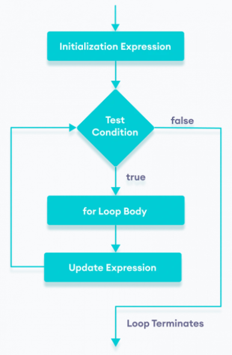

# Sentencia _FOR_

Un bucle de conteo, o bucle controlado por un contador, es un bucle en el que sabes de antemano cuántas veces se repetirá. Como por ejemplo el siguiente código que cuenta hasta 100:

```java
    int i = 0;

    while (i < 100) {
        System.out.println(i):
        i++;
    }
```

Aunque podemos usar una estructura while como la anterior para codificar un bucle de conteo, Java posee una estructura para éste propósito, el bucle _**for**_.
El bucle for se utiliza cuando el número de iteraciones es conocido. Mientras que while y do-while se utiliza generalmente cuando el número de iteraciones no se conoce.

```java
    for(inicializador; condición; modificador) {
        //cuerpo del bucle
    }

    //VARIANTES: Si solo tiene una sentencia en el cuerpo también 
    //se puede escribir sin llaves
    for(inicializador; condición; modificador)
        //sentencia;

    for(inicializador; condición; modificador) //sentencia;

```

```java
    for(int i = 0; i < 100; i++) {
        System.out.println(i);
    }
```

Proceso:

1. Inicializador: inicializa y/o declara variables y se ejecuta solo una vez.
2. Condición: se evalúa la condición. Si la condición es verdadera, se ejecuta el cuerpo del bucle for.
3. Modificador: actualiza el valor de _inicializador_.
4. La condición se evalúa nuevamente. El proceso continúa hasta que la condición es falsa.



## Ejemplo: _Imprime cualquier texto por pantalla 4 veces_

```java
    for (int i = 1; i <= 4; ++i) {
        System.out.println("This is a for loop.");
    }
```

Salida

```code
    This is a for loop.
    This is a for loop.
    This is a for loop.
    This is a for loop.
```

Traza

| Iteración | Variable     | i <= 4 | Acción          |
|-----------|--------------|---------|-----------------|
| 1a        | i=1  | true    | imprime texto, i=2       |
| 2a        | i=2  | true    | imprime texto, i=3      |
| 3a        | i=3  | true    | imprime texto, i=4      |
| 4a        | i=4  | true    | imprime texto, i=5      |
| 5a        | i=5  | false   | termina         |

La variable de inicialización en el bucle for, puede ser declarada en otro lugar del código.
Ejemplo:

```java
    int i;

    //código

    for (i = 1; i <= 4; ++i) {
        System.out.println("This is a for loop.");
    }
```

Pero esto, viola la idea de que todas las partes del bucle se combinan en una sola declaración. Por tanto, estaría bien si la declaración de la variable i forma parte de la declaración for.

{==

Una variable declarada en una instrucción for solo se puede usar en esa instrucción y en el cuerpo del bucle.

==}

### Ejemplo suma dígitos de un número

```java
//con un bucle while
public static void main(String[] args) {
    int numero = 479; //4+7+9=20
    int suma = 0;
    int digito = 0;

    while(numero > 0) {
        digito = numero % 10;//obtengo el último dígito, menos significativo
        suma += digito;
        numero /= 10;//hago el número más pequeño, le quito el último dígito
    }
    System.out.println(suma);
}

//con un bucle for
public static void main(String[] args) {
    int suma = 0;
    int digito = 0;
    for (int numero = 479; numero > 0; numero/=10) {
        digito = numero % 10;
        suma+=digito;
    }
    System.out.println(suma);
}
```

!!! Note Nota
    Si creo un bucle de la siguiente forma `for(int i = 0; i < 10; i++);` ese bucle no hará nada, porque acaba en `;`.
    Con el `;` estamos indicando fin de statement o sentencia, es decir, fin de bucle, cualquier línea detrás del ; no será parte del bucle. Esto no solo se aplica para el bucle `for`, también para la sentencia `if` o `while`.

## Bucle infinito

Un límite de bucle es un valor que controla cuántas veces se repite un bucle. Un bucle se repetirá hasta que se alcance su límite de bucle. La condición del bucle debe ser una expresión booleana que pruebe si se ha alcanzado el límite del bucle. De manera similar, el actualizador debe modificar el contador del bucle para que avance hacia su límite.

Si nunca se alcanza el límite del bucle, la condición del bucle nunca se volverá falsa y el bucle se repetirá para siempre. Esto se conoce como **bucle infinito**.

Para salir de un programa con bucle infinito presiona CONTROL+C.

## Bucle for-each

Lo veremos más adelante, cuando veamos los arrays y colecciones.
