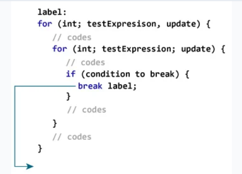

# Break y continue

Las sentencias break y continue son las sentencias de salto que se utilizan para omitir algunas sentencias dentro del bucle o terminar el bucle inmediatamente sin comprobar la condición. Estas instrucciones se pueden usar dentro de cualquier bucle, como for, while, do-while.

## BREAK

Ya se ha visto la instrucción break utilizada en un capítulo anterior de este tutorial. En concreto en la estructura switch.

La sentencia **break** en java se usa para terminar el bucle inmediatamente.

Cuando se encuentra una sentencia break dentro de un bucle, la iteración del bucle se detiene ahí y el control vuelve a la primera sentencia **después** del bucle, es decir, la primera sentencia que se encuentra al salir del bucle.

Básicamente, las instrucciones break se utilizan en situaciones en las que no estamos seguros del número real de iteraciones del bucle o queremos terminar el bucle en función de alguna condición.

```java
    for (int i = 0; i < 10; i++) {
        if (i == 3)
            break;
        System.out.print(i + " ");
    }

    System.out.println("Fuera del bucle for");
```

```java
Output: 0 1 2
Fuera del bucle for
```

!!! Note
    En el caso de bucles anidados, la instrucción break termina el bucle más interno.

## Break etiquetado

Hasta ahora, hemos utilizado la sentencia break sin etiquetar. Sin embargo, hay otra forma de utilizar break en Java conocido como break etiquetado (labeled break).



En la imagen se ha utilizado un break etiquetado con el identificador **_label_** para especificar el bucle exterior. Observa cómo se usa la declaración break con etiqueta.

La sentencia break está terminando la sentencia etiquetada (es decir, el bucle externo). Luego, el control del programa salta a la sentencia justo después de la etiquetada.

De esta forma, podríamos utilizar la sentencia break etiquetada para terminar el bucle más externo como se ve en el siguiente ejemplo:

```java
    public static void main(String[] args) {
   
        //el primer bucle es etiquetado como primero
        primero:
        for( int i = 1; i < 5; i++) {

            // el segundo bucle como segundo
            segundo:
            for(int j = 1; j <= 2; j ++ ) {
                System.out.println("i = " + i + "; j = " +j);
             
                // se realiza un break del primer bucle
                if ( i == 2)
                    break primero;
            }
        }
    }
```

```text
Output
i = 1; j = 1
i = 1; j = 2
i = 2; j = 1
```

## CONTINUE

La instrucción **continue** en Java se usa para omitir la iteración actual de un bucle y continuar con la siguiente iteración del bucle.

Podemos usar la instrucción continue dentro de cualquier tipo de bucle, como el bucle for, while y do-while.

Básicamente, las sentencias continue se utilizan en situaciones en las que queremos continuar el ciclo pero no queremos la sentencia restante después de la sentencia continue.

```java
    for (int i = 0; i < 5; i++) {
        if (i == 2)
            continue;

        System.out.print(i + " ");
    }
```

```java
Output: 0 1 3 4
```
