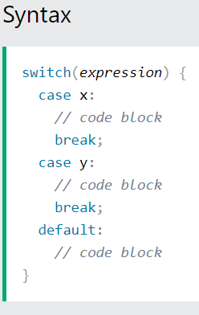

# Sentencia _SWITCH_

Otra estructura de selección o alternativa para agregar a nuestro repertorio es la estructura **_switch_**.



La expresión **switch** se evalúa una vez.
El valor de la expresión se compara con los valores de cada caso. Si hay una coincidencia, se ejecuta el bloque de código asociado. Las palabras clave [**break**](#break) y [**default**](#default) **son opcionales**. Los casos (case) suelen ser literales que no varían, y a menudo se usan constantes o el tipo de dato enum.

Es una forma abreviada de codificar la [estructura de selección múltiple](./1seleccion.md#sentencia-condicional-if-else-multiple) que vimos en el capítulo anterior.

De forma que el siguiente código expresado con if-else múltiple:

```java
    if (numJugadores == 1) {
        System.out.println("Single player");
    } else if (numJugadores == 2) {
        System.out.println("Two player");
    } else if (numJugadores == 3) {
        System.out.println("Multiplayer");
    } else {
        System.out.println("Not possible, too many players");
    }
```

Es equivalente a:

```java
    switch (numJugadores) {
        case 1:
            System.out.println("Single player");
            break;
        case 2:
            System.out.println("Two player");
            break;
        case 3:
            System.out.println("Multiplayer");
            break;
        default:
            System.out.println("Not possible, too many players");
    }
```

## _BREAK_

Cuando el programa Java alcanza la palabra break, se sale del bloque switch. Es decir, ya no se sigue ejecutando más código dentro del switch ni ningún case.

{==

Un break puede ahorrar mucho tiempo de ejecución porque "ignora" la ejecución de todo el resto del código switch.

==}

## _DEFAULT_

La palabra default se usa para ejecutar código cuando no hay ninguna coincidencia con ningún caso (_case_).
Siempre se pone al final, por tanto no necesita de la instrucción _break_.
