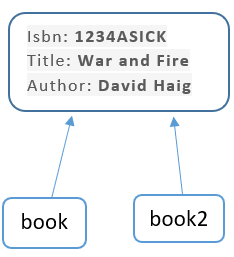
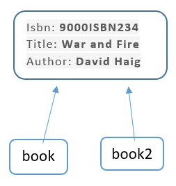

# 🌎 Creación e inicialización de objetos de la clase

Para crear objetos de la clase, podemos hacerlo de dos formas:

+ Creando un variable de la clase como hemos hecho hasta ahora:

```java
Coche seat; //(Aquí la variable no está inicializada y
// puede dar errores de compilación).
```

+ Utilizando la palabra resevada **_new_** más el nombre de la clase:

```java
Coche seat = new Coche(); //En este caso la variable es creada e inicializada
```

## Constructor

Cuando usamos la palabra **new** Coche(); para crear un objeto de la clase Coche, en realidad estamos usando lo que se conoce como el constructor de la clase para crear el coche.
El constructor por normal general da valor a los campos de la clase.

## Constructor por defecto

En Java cuando creamos un objeto con la sentencia new Coche(), se lanza el llamado contructor por defecto. Si no se ha definido este en la clase, **Java lo crea y lo lanza automáticamente** e iniciliza los campos de la clase con valores por defecto.

Si queremos definirlo nosotros tenemos que usar public más el nombre de la clase.

```java
public class Coche {

    private int puertas;
    private String modelo;
    private String color;

    //Constructor por defecto
    public Coche() {

    }

    //getters y setters
}
```

## Constructor parametrizado

Un constructor parametrizado tiene uno o más parámetros. Podemos usar un constructor parametrizado en caso de que necesitemos pasar algunos valores iniciales a la variable miembro de la clase.

```java
public Coche(int puertas, String color) {
    this.puertas = puertas;
    this.color = color;
}
```

## Constructor sobrecargado

Ahora surge la pregunta de si una clase puede tener más de un constructor o si una clase solo puede tener un constructor. Podemos tener varios constructores en una clase.
Los constructores pueden ser sobrecargados al igual que los métodos, es decir, podemos tener más de un constructor en nuestra clase siempre que cambiemos el número de parámetros.
Por ejemplo:

```java
public Coche(String modelo) {
    this.modelo = modelo;
}

public Coche(int puertas, String color) {
    this.puertas = puertas;
    this.color = color;
}

public Coche(int puertas, String modelo, String color) {
    this.puertas = puertas;
    this.color = color;
    this.modelo = modelo;
}
```

Estos serían dos constructores diferentes para el objeto Coche, donde en uno se construye usando el modelo y en el otro el número de puertas.

A estos constructores también se les conoce como constructor parametrizado.

!!! Warning
    Si se define un constructor con parámetros en la clase, Java entiende que la clase tiene una forma de construirse y no creará de forma automática el constructor por defecto Coche().
    Por tanto si tenemos código como Coche coche = new Coche(); nos lanzará un error de compilación.

## Llamar a un constructor desde otro dentro de la misma clase

Hemos comentado que podemos tener más de un constructor en nuestra clase gracias a la sobrecarga. En corcondancia con esto, también podemos llamar a un constructor desde otro constructor.

Por ejemplo, el constructor por defecto es llamado cuando hacemos new Coche(); pero dentro de este constructor no se inicializa ningún campo, y tal vez nosotros queramos crear el objeto con algunos valores predeterminados. Entonces llamaríamos desde dentro del constructor por defecto a un constructor parametrizado.

```java
public Coche() {
    this(5, "blanco");//invoco al constructor con 2 parámetros
}

public Coche(int puertas, String color) {
    this(puertas, "desconocido", color);//invoco al constructor con 3 parámetros
}

public Coche(int puertas, String modelo, String color) {
    this.puertas = puertas;
    this.color = color;
    this.modelo = modelo;
}
```

En el código anterior, cada vez que creamos un coche vacío, le asignamos por defecto 5 puertas y color blanco como valores predeterminados.

Con esto te aseguras que el objeto se crea con todos los campos inicializados.

## Constructor copia en Java

Cuando igualamos dos objetos, **no estamos haciendo una copia del objeto**, lo que hacemos es apuntar a ese mismo objeto en memoria. En el siguiente ejemplo tenemos dos variables `book` y `book2` apuntando al mismo objeto en memoria, es decir, cualquier cambio que realice alguna de las variables, afectará al objeto en sí apuntado por las mismas.

```java
    Book book = new Book("1234ASICK", "War and Fire", "David Haig");
    Book book2 = book;
    book2.setIsbn("9000ISBN234");
    System.out.println(book.getIsbn());//imprimirá 9000ISBN234
```

|                                          |                                                                                |
|--------------------------------------------------------|------------------------------------------------------------------------------------|
| Variables `book` y `book2` apuntando a un mismo objeto | Modificación del isbn por la variable `book2`, pero `book` también se ve reflejada |

Si queremos realizar una copia de un objeto, es decir, traspasar los valores que tiene a un nuevo objeto, necesitamos invocar al **constructor copia**.

**El constructor copia es un tipo de constructor que recibe como parámetro un objeto de la misma clase.** Es decir, en este caso estamos creando objetos de tipo coche, por lo que el constructor recibirá por parámetro un objeto de este tipo. Veamos entonces un ejemplo donde se muestra este tipo de constructor:

```java
public class Coche {

    private int puertas;
    private String modelo;
    private String color;

    //Constructor copia
    public Coche(Coche objCoche) {
        this.puertas = objCoche.puertas;
        this.color = objCoche.color;
        this.modelo = objCoche.modelo;
    }

}
```

## Destructor

En algunos lenguajes de programación, para destruir un objeto, existen varios métodos o funciones que se ejecutan de forma automática para destruirlo. Esta función no devuelve ningún valor, (por lo tanto es de tipo void), y no recibe ningún parámetro.

Por otro lado, es importante destacar que **en java no existen destructores**. Java es un lenguaje que posee un recolector de basura (garbage collector). Este recolector de basura, ejecuta automáticamente un método llamado **finalize()**. Por lo tanto, cuando un programa java ya no está utilizando un objeto se realizan dos acciones:

+ Por un lado entra en acción de forma automática el garbage collector.
+ Este recolector de basura llama al método finalize() y lo ejecuta.
+ Para finalizar, se destruye el objeto y se liberan los recursos utilizados en la memoria RAM del ordenador.
