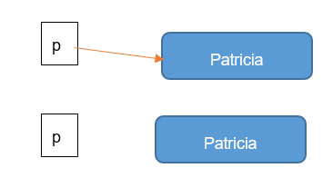

# 🌎 Valor nulo

Una variable de referencia contiene información sobre la ubicación de un objeto. No contiene el objeto en sí.

Por ejemplo el siguiente código:

```java
 String str;
 Persona p;
```

declara dos variables de referencia pero no construye ningún objeto. Con el siguiente código:

```java
 str = "Programación";
 p = new Persona("Patricia");
```

se construyen los objetos y se colocan referencias en las variables.

**_null_** es un valor especial que significa "sin objeto". Se establece una variable de referencia a _null_ cuando no se refiere a ningún objeto. Las variables a menudo se asignan en nulas cuando se declaran:

```java
 String str = null;
 Persona p = null;
```

_str_ y _p_ todavía no son objetos, son variables que en un futuro pueden referenciar a objetos.

Podemos asignar el valor null a cualquier variable de tipo referencia, ya sea un objeto, string, array, etc.

Una variable de referencia a veces hace referencia a un objeto y otras veces no, y puede referirse a diferentes objetos en diferentes momentos. Por tanto, necesitamos una forma de decir que una variable ahora no se refiere a un objeto. Para ello, se le asigna un valor _null_ a la variable.



El objeto Persona con el nombre de Patricia se destruirá eventualmente por el _garbage collector_ ya que no es referenciado por nadie.
