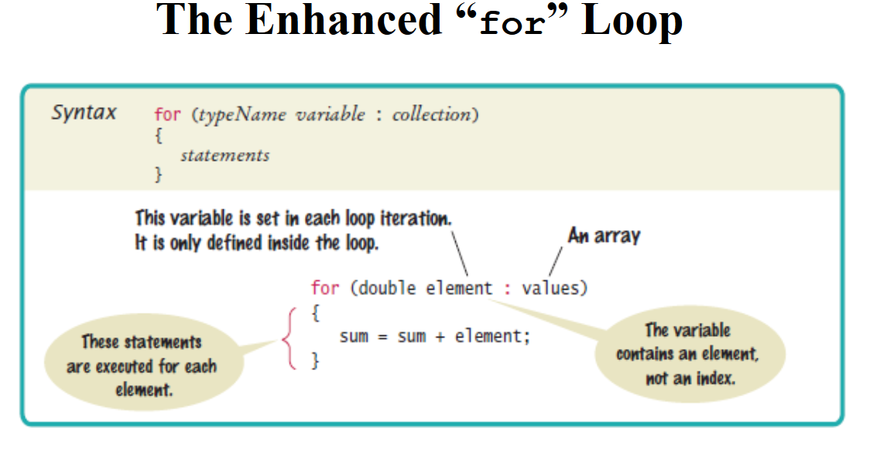

# Algoritmos de arrays útiles

Un array que utiliza un solo índice para acceder a sus valores se denomina _**array unidimensional**_, ya que utilizamos el índice para acceder a todas las celdas del array. Éstas celdas están alineadas de forma secuencial.

Un array bidimensional necesita dos índices para acceder a los valores. En este caso las celdas están dispuestas en forma de matriz, como una estructura rectangular.

Es posible crear arrays de mayores dimensiones aunque rara vez se utilizan.

## Contar los elementos que contiene un array

Cuando utilizamos arrays, es muy molesto contar los elementos de un array para saber su tamaño. Afortunadamente, todo objeto de tipo array tiene una variable de instancia llamada **_length_** que contiene el tamaño del array, es decir, el número de celdas.

## Imprimir los elementos de un array

Un algoritmo muy utilizado cuando trabajamos con arrays es mostrar los valores que contiene el array en cada una de sus celdas. Para ello nos ayudamos del campo **length** que nos devuelve la longitud del array.

```java
public static void imprimirArray(int[] array) {
    for(int i = 0; i < array.length; i++) {
        System.out.println("Elemento " + i + " valor " + array[i]);
    }
}
```

## Leer y rellenar los elementos de un array por teclado

Es muy común que los elementos de un array sean valores introducidos de alguna forma por el usuario. El ejemplo más sencillo es leerlos directamente desde la entrada de flujo, a la vez que leemos el valor insertado por el usuario se lo asignamos al array.

```java
    int[] array = new int[elementos];

    for (int i = 0; i < array.length; i++) {
        array[i] = sc.nextInt();
    }
```

## Algoritmo

Cualquier procedimiento sistemático utilizado para calcular algo se llama **_algoritmo_**.
Por ejemplo si queremos sumar todos los elementos de un array realizaremos un algoritmo.
Un algoritmo es una descripción de cómo hacer algo. No está vinculado a ningún idioma en particular. Un algoritmo se puede implementar en cualquier lenguaje de programación de computadoras.

El programa siguiente muestra un ejemplo de un algoritmo. Aquí la variable **_suma_** juega el papel de almacenar la suma de los elementos que se van leyendo. El programa recorre elementos del array comenzando en el índice 0 y yendo hasta el final.

```java
    public static int suma(int[] array) {
        int suma = 0;
        for (int i = 0; i < array.length; i++) {
            suma += array[i];
        }
        return suma;
    }
```

## Clásico error 1: no testear los límites del array

Cuando trabajamos con arrays, a menudo nos puede ocurrir que olvidamos el último elemento del array, si cambiamos la condición del bucle por **_i < array.length -1_**, o olvidamos el primer elemento si establecemos el índice en  **_int i = 1_** porque creemos que el primer elemento está en la posición 1 del array.

Estos son errores clásicos: no probar los límites de los arrays, es decir, el primer elemento o el último.

Por ejemplo, en el siguiente código no quiero tener números de una cifra en mi array.

```java

    int[] array =  {2, 19, 1, 5, 1, 27, 9, 5};

    for (int i = 0; i < array.length-1; i++) {
        if (array[i] < 10)
            array[i] = array[i] * 10;
    }
```

Cuando recorro el array, el último elemento no sería testeado por tanto me devolvería un 5 en vez de 50. El programa sería incorrecto.

## Clásico error 2: exceder los límites del array

Al contrario que, en el apartado anterior, si intentamos acceder a una celda del array que no existe, se lanzará una ArrayIndexOutOfBoundsException y el programa se detendrá.

Los errores de acceso a la última posición del array + 1 son muy comunes. Un ejemplo sería:

```java

    int[] array =  {2, 19, 1, 5, 1, 27, 9, 5};

    for (int i = 0; i <= array.length; i++) {
        if (array[i] < 10)
            array[i] = array[i] * 10;
    }
```

## Bucle foreach (enhanced for loop)

Para evitar que los errores mencionados anteriormente ocurran, Java dispone de un bucle mejorado que visita cada elemento del array en orden sin necesidad de establecer un índice. Por tanto, los errores de exceder los límites del array se eliminan automáticamente con este bucle.

La sintaxis es la siguiente:



Este bucle de lee en voz alta de la siguiente manera: "para cada valor del array..." (for each value in array...)

El tipo de dato de la variable que se crea en el bucle es igual al de cada una de las celdas del array, y va a contener los valores de ellas. En la primera iteración contrendrá el valor de la primera celda del array, y así sucesivamente hasta llegar a la última celda del array.

Ejemplo:

```java
    int[] array =  {2, 19, 1, 5, 1, 27, 9, 5};
    int suma = 0;
    for (int numero : array) {
            suma += numero;
    }
```

## Comparar si dos arrays son iguales

Es muy usual utilizar el operador "==" cuando queremos comparar si dos arrays son iguales, es decir, si contienen los mismos elementos. Pero si ejecutamos el siguiente código:

```java
    int[] array1 =  {1, 2, 3};
    int[] array2 =  {1, 2, 3};
    
    System.out.println(array1 == array2); //imprime false
```

Obtenemos _false_, esta situación es parecida a cuando intentábamos comparar dos String. Recordar que utilizar el operador "==" era incorrecto ya que son objetos diferentes aunque tuvieran el mismo contenido.

Si utilizamos el método _equals()_ para arrays, devolvería el mismo valor booleano que el operador "==".

```java
    System.out.println(array1.equals(array2)); //imprime false
```

Para comprobar que dos arrays contienen los mismos elementos se utiliza la clase **Arrays**.

La clase Arrays contiene muchos métodos estáticos para manipular matrices. Dado que los métodos son estáticos, **los invoca utilizando el nombre de la clase**.

```java
    int[] array1 =  {1, 2, 3};
    int[] array2 =  {1, 2, 3};

    System.out.println(Arrays.equals(array1, array2)); //imprime true
```

El método _Arrays.equals_ comprueba que dos arrays son iguales si tienen la misma longitud y contienen los mismos elementos en el mismo orden.
