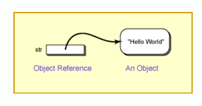

# Array de objetos

Una característica importante de los arrays, es que todos los elementos deben ser del mismo tipo.

Hasta ahora, hemos estudiado arrays con elementos de tipos primitivos. Sin embargo, también se puede crear arrays con elementos de cualquier tipo de datos, incluidas las referencias a objetos.

Recordemos que, cuando hacemos `String str;`, se declara una variable llamada `str` que almacena la referencia a un objeto de tipo String, pero el objeto todavía no ha sido creado.

Un objeto existe solo después de haber sido construido. Los objetos se construyen solo mientras se ejecuta un programa cuando se invoca **el constructor**.

Una vez construido, se accede a un objeto siguiendo una referencia al objeto. A menudo, la referencia se mantiene en una variable de referencia como `str`.

En el siguiente ejemplo, se declara una variable de referencia, se construye un objeto y luego la referencia al objeto se coloca en la variable de referencia:

```java
String str;             // declara una variable de tipo referencia
str = "Hello World" ;   // construye el objeto y 
                        // almacena su referencia
```



## Array de Strings

Para declarar un array de Strings ser realizaría de la siguiente forma:

```java
String[] array = new String[5];

array[0] = "Hello";
array[1] = "World";
...
```


Cada objeto String del ejemplo es un String normal. Nada en él ha cambiado porque su referencia se mantiene en el array. Cada cadena puede tener cualquier número de caracteres.

## Argumentos de línea de comandos

Como ya sabemos el método `main` recibe un array de Strings como parámetro:

```java
    public static void main(String[] args) {
    }
```

Es decir, main recibe una referencia a un array de referencias de String. Este array es construido por el sistema Java justo antes de que `main()` obtenga el control. Los elementos que contiene el array son cadenas de texto que se pasan en la línea de comando que inicia el programa. Por ejemplo, digamos que un programa se inicia con esta línea de comando:

> java Demo cadena1 cadena1

Donde `Demo` es el nombre del programa, `cadena1` es el primer argumento y `cadena2` el segudno.

Por tanto `args[0]` contendrá cadena1 y `args[1]` cadena2.

Puede haber cualquier número de argumentos en la línea de comandos. Los argumentos son siempre cadenas de caracteres. Cada argumento está separado del resto por espacios.

A veces, se quieren enviar número por línea de comandos. Por tanto necesitaremos convertir las cadenas de dígitos en números. Para ello, utilizaremos el método `Integer.parseInt(String)` o `Double.parseDouble(String)`.

## Espacio de memoria en arrays de objetos

Como hemos comentado, en arrays de objetos, Java almacena solo la referencia al objeto en el propio array, en lugar de todo el objeto. Esto conserva la memoria, ya que las referencias requieren solo **4 bytes** cada una, mientras que cada objeto puede requerir cientos de bytes.

Ejemplo, para un array de 15 enteros, sabiendo que cada entero requiere 4 bytes de almacenamiento, se almacenará 60 bytes contiguos de memoria.
