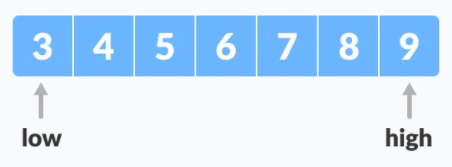
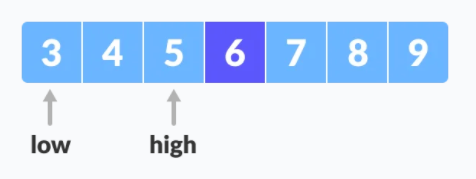

# Algoritmos de búsqueda

Supongamos que tenemos un array de grandes dimensiones y necesitamos encontrar uno de sus elementos. Necesitamos un algoritmo para buscar en el array un valor particular, generalmente llamado `clave`. Si los elementos del array no están organizados en ningún orden en particular, la única forma en que podemos estar seguros de encontrar la clave, asumiendo que está en el array, es buscar cada elemento, comenzando por el primer elemento, hasta encontrarlo.
Este algoritmo es conocido como **búsqueda lineal o secuencial**.

## Búsqueda secuencial

En la búsqueda secuencial, cada elemento del array se examinará en secuencia hasta que se encuentre la clave (o se llegue al final del array).

### **Algoritmo búsqueda secuencial**

Este algoritmo se puede implementar fácilmente en un método que busca un array de enteros, que se pasa como parámetro del método y la `clave` a buscar. Si la `clave` se encuentra en el array, se devuelve su ubicación. Si no se encuentra, se devuelve `−1` para indicar fallo.

```java
public class Search {

   public static int sequentialSearch(int[] array, int key) {
      for (int i = 0; i < array.length; i++) {
         if (array[i] == key) {
            return i;
         }
      }
      return -1; //no lo ha encontrado
   }

}
```

**Big O notation** es una notación para representar la complejidad temporal de un algoritmo, su rendimiento. Generalmente describe el peor escenario, es decir, el máximo tiempo en la mayor cantidad de repeticiones que el algoritmo tiene que ejecutar.

+ Big-O de una búsqueda secuencial es O(n) en el peor de los casos y O(1) en el mejor.

## Búsqueda binaria

La búsqueda binaria es un algoritmo de búsqueda para encontrar la posición de un elemento en un array ordenado.

>La búsqueda binaria **solo se puede implementar en una lista ordenada de elementos**. Si los elementos no están ordenados, primero debemos ordenarlos.

El algoritmo de búsqueda binaria se puede implementar de dos formas diferentes:

1. Método iterativo
2. Método recursivo. El método recursivo sigue el enfoque de **divide y vencerás**.

### ¿Cómo se hace?

1. El array en el que se va a realizar la búsqueda es. Sea `x = 4` el elemento a buscar.

2. Establezce dos punteros `low` y `high` en las posiciones más baja y más alta, respectivamente.

3. Encuentra el elemento del medio `mid` en la mitad del array, es decir, `mid = (low + high)/2; array[mid] = 6`.

4. Si `x == array[mid]`, devuelve `mid`. De lo contrario, compara el elemento que se va a buscar con `m`.
5. Si `x > array[mid]`, comparamos `x` con el elemento medio de los elementos en el lado derecho de `mid`. Esto se hace estableciendo `low` a `low = mid + 1`.
6. De lo contrario, comparamos `x` con el elemento central de los elementos en el lado izquierdo de `mid`. Esto se hace estableciendo `high` a `high = mid - 1`.

7. Repetimos los pasos 3 a 6 mientras que `low` sea menor igual que `high`.

8. `x = 4` se ha encontrado.


Al método se le pasa el `array`, la `clave`, y las posiciones `low` y `high`.

+ Big-O para la búsqueda binaria es O(log N) en el peor de los casos y O(1) en el mejor caso.