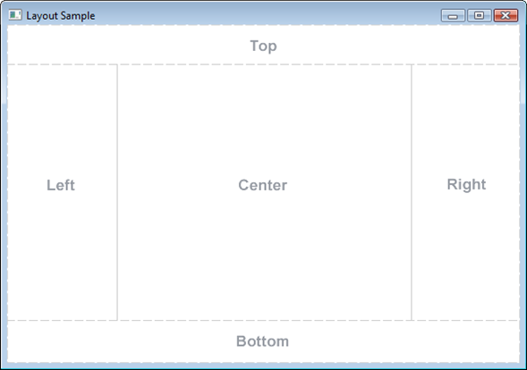

# Layout

Los contenedores o paneles de diseño (layout) nos permiten añadir controles de la interfaz de usuario dentro de un gráfico de escena de una aplicación JavaFX sin tener que escribir el código necesario para gestionar el posicionamiento o el cambio de tamaño de esos controles. El Layout gestionará todo eso por nosotros. La API de layout de JavaFX incluye 8 layouts:

1. `BorderPane`: presenta sus nodos de contenido en la región superior, inferior, derecha, izquierda o central.

2. `HBox` organiza sus nodos de contenido horizontalmente en una sola fila y los dimensiona con sus tamaños preferidos. Normalmente usamos un HBox para diseñar un conjunto de botones en un diálogo.
3. `VBox` organiza sus nodos de contenido verticalmente en una sola columna.
4. `StackPane` coloca sus nodos de contenido en una sola pila de atrás hacia adelante.
5. `GridPane` permite al desarrollador crear una cuadrícula flexible de filas y columnas en la que diseñar los nodos de contenido. Cada posición de la cuadrícula se llama celda. Un fila será tan alta como el control más alto y una columna será tan ancha como el control más ancho que contiene.
6. `FlowPane` organiza sus nodos de contenido en un "flujo" horizontal o vertical, envolviéndose en los límites especificados de ancho (para horizontal) o alto (para vertical).
7. `TilePane` coloca sus nodos de contenido en mosaicos o celdas de diseño de tamaño uniforme y los envuelve como hace `FlowPane`.
8. `AnchorPane` permite a los desarrolladores crear nodos de anclaje en la parte superior, inferior, izquierda o central del diseño.

Para lograr una estructura de diseño deseada, se pueden anidar diferentes layouts dentro de una aplicación JavaFX.

En `HBox` y `VBox` si al reducir la ventana los hijos que contienen esos paneles no caben, entonces se cortan. En cambio, con `FlowPane`, pasan a la siguiente fila en el caso de que la orientación sea horizontal y si es vertical pasarían a la siguiente columna.
